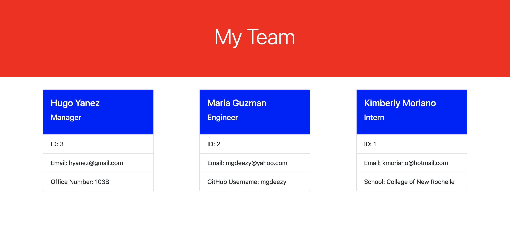

# Team Profile Generator

## Description

A program that builds a Node.js command-line application that takes in information about employees on a software engineering team, then generates an HTML webpage that displays summaries for each person. A unit test was written for every part of my code and ensures that it passes each test using the jest package.

## User Story

```md
AS A manager
I WANT to generate a webpage that displays my team's basic info
SO THAT I have quick access to their emails and GitHub profiles
```

## Mock-Up

The following image shows a mock-up of the generated HTML’s appearance and functionality:



## Links

- [Deployed Link](https://hyanez.github.io/TEAM-PROFILE-GENERATOR/)
- [Github Link](https://github.com/hyanez/TEAM-PROFILE-GENERATOR)
- [Link to Video Demonstration](https://watch.screencastify.com/v/dxQfH0Nml39GM7PzMZLF)
